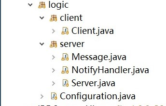

# Java课程期末作业报告——教务系统设计
## 项目背景介绍
我们主要针对学生这一特定人群，设计一个信息管理系统，即我们常用的教务系统。教务系统对学生来说，就是日常生活中离不开的物品，选课、查阅信息等，对我们的学习生活发挥了很大的作用。既然教务系统对我们如此重要，我们小组就利用Java技术实现一个简单的教务系统。

## 系统功能介绍
通过教务系统我们可以方便地管理我们的信息，并可以查询相应的课程信息、成绩等。通过Java的GUI设计，我们的系统具有相对人性的系统界面。
### 登录界面
我们通过应用一开始的登录界面，可以进行注册用户还有登录用户两项功能。
当然，如果登录时，出现密码错误或者用户不存在的情况，我们也会作出相应的提示。
<!--  -->


### 个人信息修改
当然，完成注册以后，我们还可以根据需要重新修改我们的个人信息。


而且通过表格的方式呈现我们的选课信息，我们可以很方便地查询、排序、筛选过滤我们所需的信息。


### 查询课程
与上面的登录密码校验不同，我们设计的教务系统实现的查询主要创新点在于，我们设计其支持模糊查询的功能，我们只需输入两三个字符，我们的课程信息表单就可以显示出对应的符合要求的课程信息。


由上面的图片可知，我们所设计的模糊查询，只要课程中有相应的关键字，即可查询到对应的信息。

## 系统类图


## 关键模块说明
### 项目框架
我们的分成源码、数据、以及外部资源和程序截图等。
data文件夹用于持久化存储数据，使用了文件存储技术。


我们的项目设计主要使用了三层架构的设计模式。即，界面层（User Interface layer）、业务逻辑层（Business Logic Layer）、数据访问层（Data access layer）。这样的设计方式旨在降低程序之间的耦合度，方便我们的修改。

#### 数据层类
数据层的类有四个```Course```、```CourseDB```、```User```、```UserDB```。
通过上面的系统类图可以很清晰地看出他们之间的关系。
```User```中可以访问该用户已经选择的课程，```Course```中也可以查看选择该课程的用户。
而数据库（包含```UserDB```和```CourseDB```）存储整个系统中含有的所有用户和所有的课程。两个数据库都提供了相当多的接口，用于和逻辑层直接交互。
<!-- 
 -->


#### 界面层类
界面层类里主要有```GUI```一个主类，```UIConst```主要记下```GUI```界面所用到的相关设置。```gui```内有一个名为```panel```的包，存储我们所需要跳转的相关页面；还有一个```component```的包，存储为实现一些特定功能的而特别设计的组件。

#### 业务逻辑层类
业务逻辑层主要实现了网络编程的相关功能。```logic```包内只有一个文件```Configuration```，它提供地址服务器的地址和端口，用于客户端和服务器之间进行沟通。

客户端只有相应的```Client```类，主要
